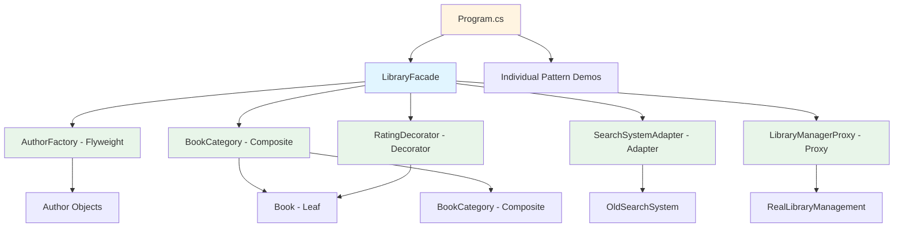
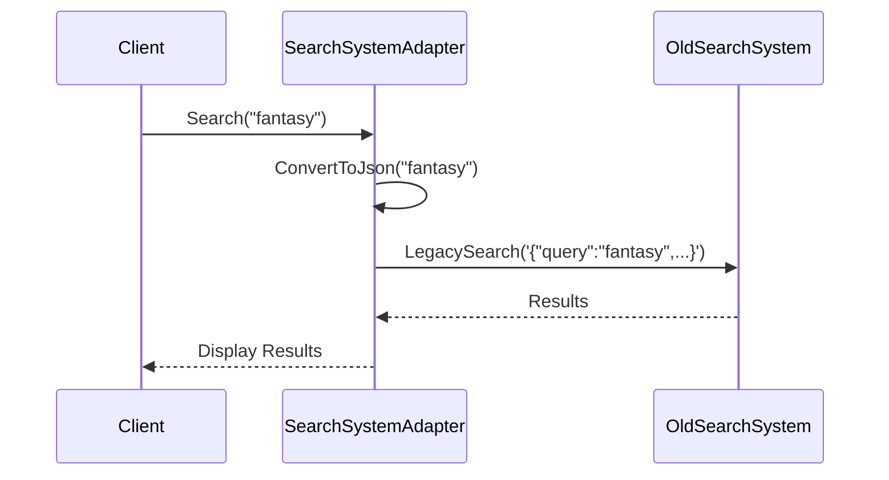
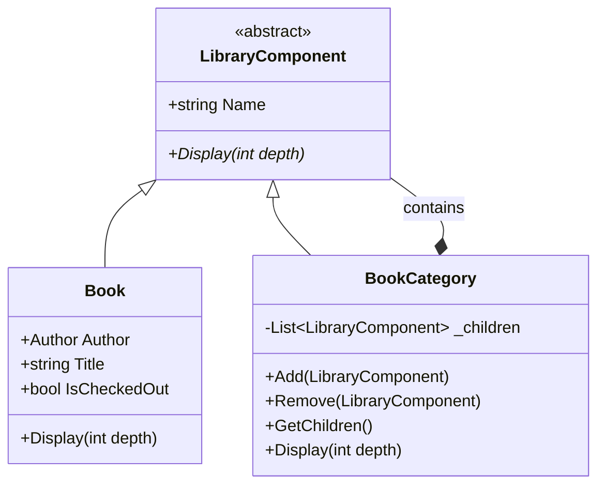
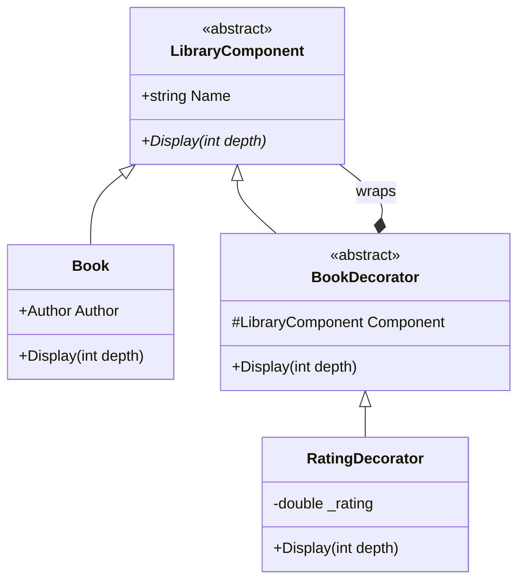
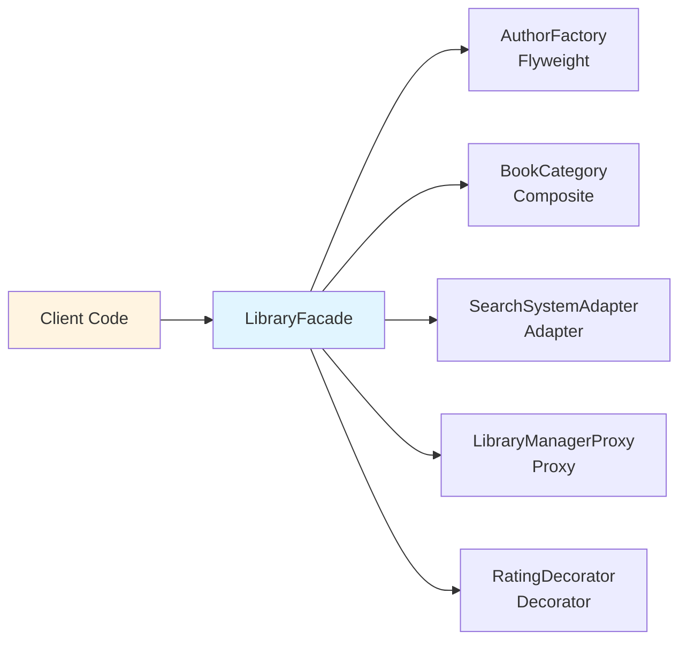
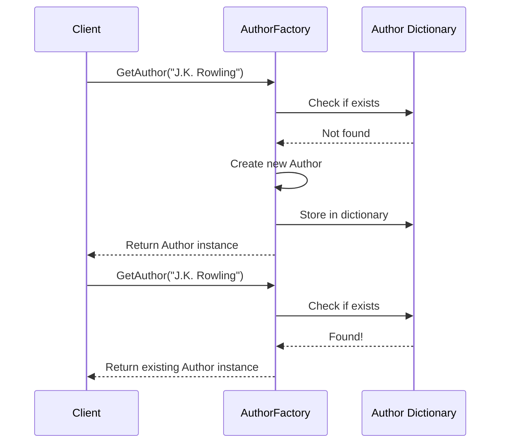
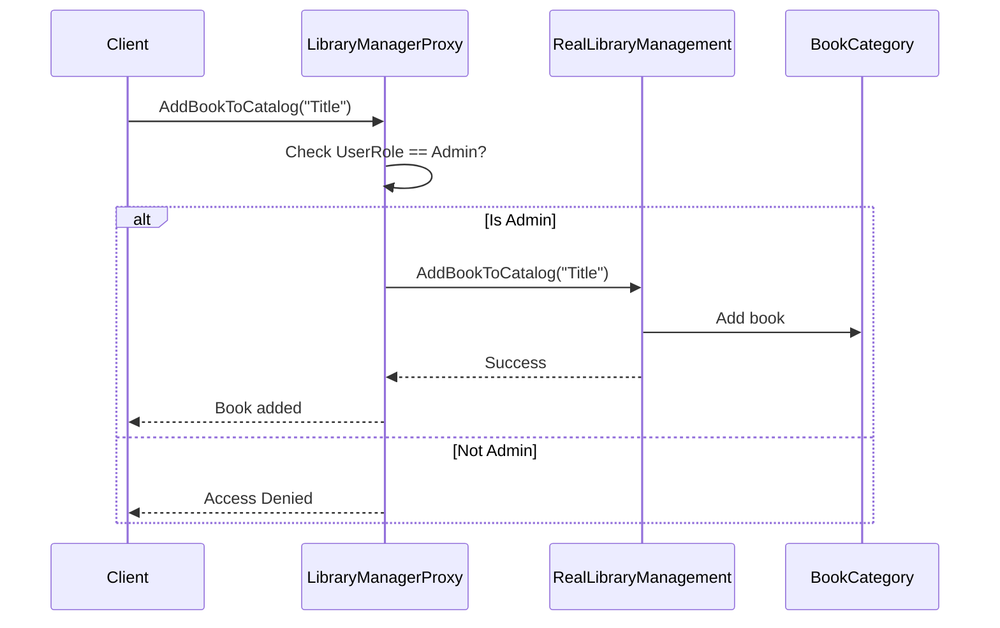
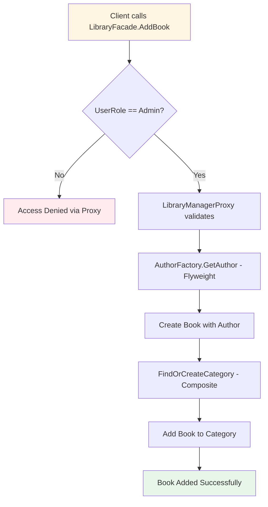
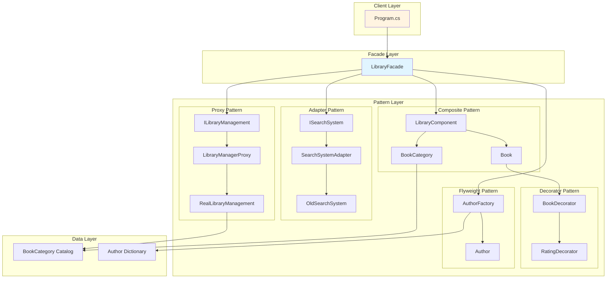
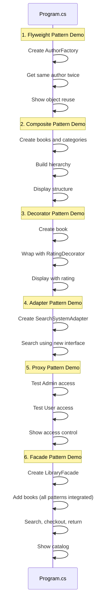

# Library System Patterns - Project Structure Explanation

## Overview

This project implements a Library Management System using 6 structural design patterns as specified in `task.txt`. The system demonstrates how these patterns work together to create a flexible, maintainable library management application.

## Project Architecture

The project follows a modular structure where each design pattern is implemented in its own namespace and folder:

```
LibrarySystemPatterns/
├── Patterns/
│   ├── Adapter/          # Pattern 1: Adapter
│   ├── Composite/        # Pattern 2: Composite
│   ├── Decorator/        # Pattern 3: Decorator
│   ├── Facade/           # Pattern 4: Facade
│   ├── Flyweight/        # Pattern 5: Flyweight
│   └── Proxy/            # Pattern 6: Proxy
├── UserRole.cs           # User role enumeration
├── Program.cs            # Main demonstration
└── task.txt              # Requirements specification
```

## Visual Project Structure



## Pattern Implementation Details

### 1. Adapter Pattern (`Patterns/Adapter/`)

**Requirement from task.txt**: Integrate old search system with incompatible interface

**Implementation**:
- `ISearchSystem.cs`: New interface with `Search(string query)` method
- `OldSearchSystem.cs`: Legacy system that only accepts JSON queries via `LegacySearch(string jsonQuery)`
- `SearchSystemAdapter.cs`: Adapts new interface to old system by converting string queries to JSON

**How it works**: The adapter wraps the old system and transforms simple string queries into JSON format before calling the legacy method.



### 2. Composite Pattern (`Patterns/Composite/`)

**Requirement from task.txt**: Create hierarchical structure for books and categories (e.g., "Fantasy" → "Space Opera" → books)

**Implementation**:
- `LibraryComponent.cs`: Abstract base class for both books and categories
- `Book.cs`: Leaf component representing individual books
- `BookCategory.cs`: Composite component that can contain books and subcategories

**How it works**: Both books and categories inherit from `LibraryComponent`, allowing categories to contain other categories recursively. The `Display()` method demonstrates recursive traversal.



**Example Structure**:
```
Fiction
└── Fantasy
    ├── Book: Harry Potter
    ├── Book: Game of Thrones
    └── Space Opera (subcategory)
        └── Book: Dune
```

### 3. Decorator Pattern (`Patterns/Decorator/`)

**Requirement from task.txt**: Add features like ratings to books without modifying their structure

**Implementation**:
- `BookDecorator.cs`: Abstract decorator wrapping `LibraryComponent`
- `RatingDecorator.cs`: Concrete decorator adding rating functionality

**How it works**: Decorators wrap book objects and enhance their `Display()` method to show additional information (ratings) without modifying the original `Book` class.



### 4. Facade Pattern (`Patterns/Facade/`)

**Requirement from task.txt**: Create simple interface hiding complex interactions between components

**Implementation**:
- `LibraryFacade.cs`: Single entry point that coordinates:
  - AuthorFactory (Flyweight)
  - BookCategory (Composite)
  - SearchSystemAdapter (Adapter)
  - LibraryManagerProxy (Proxy)

**How it works**: The facade provides methods like `AddBook()`, `Search()`, `CheckoutBook()`, `ReturnBook()`, and `ShowCatalog()` that internally coordinate multiple subsystems.



### 5. Flyweight Pattern (`Patterns/Flyweight/`)

**Requirement from task.txt**: Optimize storage by reusing objects for repeated data (authors)

**Implementation**:
- `Author.cs`: Lightweight object storing only author name
- `AuthorFactory.cs`: Factory that maintains a dictionary of unique authors and reuses them

**How it works**: When multiple books share the same author, the factory returns the same `Author` instance, reducing memory usage. The factory tracks unique authors in a dictionary.



### 6. Proxy Pattern (`Patterns/Proxy/`)

**Requirement from task.txt**: Control access to library operations based on user roles

**Implementation**:
- `ILibraryManagement.cs`: Interface defining library operations
- `RealLibraryManagement.cs`: Actual implementation of library operations
- `LibraryManagerProxy.cs`: Proxy that checks user roles before delegating to real implementation

**How it works**: The proxy intercepts calls to `AddBookToCatalog()`, `CheckoutBook()`, and `ReturnBook()`, verifying that the user has appropriate permissions (Admin for adding books, User/Admin for checkout/return).



## Pattern Integration Flow

The `LibraryFacade` class integrates all patterns:



**Integration Details**:

1. **Flyweight**: Uses `AuthorFactory` to get/create authors when adding books
2. **Composite**: Uses `BookCategory` to organize books hierarchically
3. **Adapter**: Uses `SearchSystemAdapter` for search functionality
4. **Proxy**: Uses `LibraryManagerProxy` for access-controlled operations
5. **Decorator**: Can wrap books with `RatingDecorator` to add ratings
6. **Facade**: Provides unified interface coordinating all above patterns

## Complete System Flow



## Requirements Mapping

| Requirement from task.txt | Implementation | Files | Pattern |
|---------------------------|----------------|-------|---------|
| **Adapter**: Integrate old search system with incompatible interface | `SearchSystemAdapter` wraps `OldSearchSystem`, converts string to JSON | `Adapter/ISearchSystem.cs`<br/>`Adapter/OldSearchSystem.cs`<br/>`Adapter/SearchSystemAdapter.cs` | Adapter |
| **Composite**: Books and categories hierarchy (Fantasy → Space Opera → books) | `BookCategory` contains `Book` and other `BookCategory` recursively | `Composite/LibraryComponent.cs`<br/>`Composite/Book.cs`<br/>`Composite/BookCategory.cs` | Composite |
| **Decorator**: Add ratings without modifying book structure | `RatingDecorator` wraps `Book` and enhances `Display()` | `Decorator/BookDecorator.cs`<br/>`Decorator/RatingDecorator.cs` | Decorator |
| **Facade**: Simple interface hiding complex interactions | `LibraryFacade` coordinates all subsystems | `Facade/LibraryFacade.cs` | Facade |
| **Flyweight**: Reuse author objects for memory optimization | `AuthorFactory` maintains dictionary of unique authors | `Flyweight/Author.cs`<br/>`Flyweight/AuthorFactory.cs` | Flyweight |
| **Proxy**: Access control by user role (Admin/User) | `LibraryManagerProxy` checks `UserRole` before delegating | `Proxy/ILibraryManagement.cs`<br/>`Proxy/RealLibraryManagement.cs`<br/>`Proxy/LibraryManagerProxy.cs` | Proxy |

## Demonstration Flow in Program.cs

The `Program.cs` file demonstrates each pattern sequentially:



## Key Design Decisions

1. **Separation of Concerns**: Each pattern is in its own folder/namespace, making the codebase modular and maintainable.

2. **Integration via Facade**: The `LibraryFacade` class serves as the single entry point, hiding the complexity of coordinating multiple patterns.

3. **Role-Based Access Control**: The `UserRole` enum and `LibraryManagerProxy` ensure that only authorized users can perform sensitive operations.

4. **Memory Optimization**: The Flyweight pattern ensures that author objects are reused, reducing memory footprint when many books share the same author.

5. **Extensibility**: The Decorator pattern allows adding new features (like ratings) without modifying existing `Book` class.

6. **Backward Compatibility**: The Adapter pattern allows integration of legacy systems without modifying them.

## Conclusion

This project successfully implements all 6 required structural design patterns from `task.txt`:
- ✅ Adapter: Legacy system integration
- ✅ Composite: Hierarchical book organization
- ✅ Decorator: Dynamic feature addition
- ✅ Facade: Simplified interface
- ✅ Flyweight: Memory optimization
- ✅ Proxy: Access control

All patterns work together seamlessly through the `LibraryFacade`, demonstrating how structural patterns can be combined to create a robust, maintainable system.
